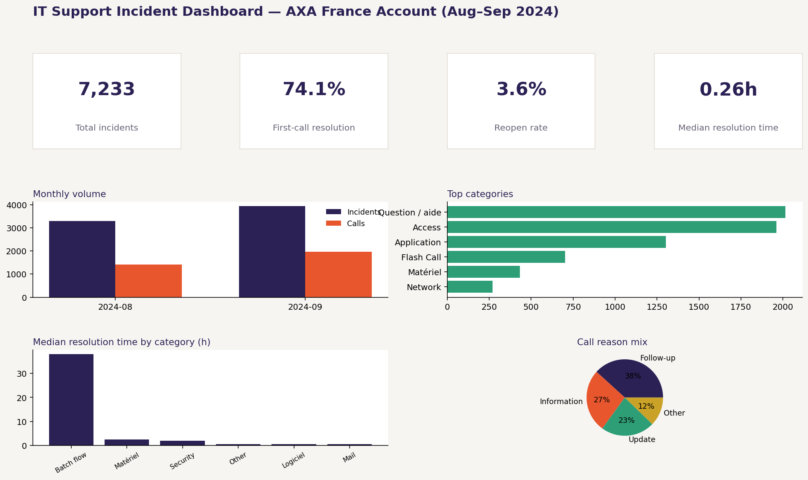

# IT Support Incident & Call Analytics — AXA France Account

Two months (August–September 2024) of IT support activity for an AXA France service desk account, analyzed to answer a few operational questions: how ticket volume is trending, where the effort actually goes, how fast issues get resolved, and what first-call resolution is really worth in practice.

The data combines a **ServiceNow incident export** with a **contact center call log**, cleaned and anonymized, then analyzed in Python and modeled as a **Power BI dashboard**.



## Data protection note

All personal identifiers — agent names and caller names — are replaced with stable anonymous codes (`Agent_0001`, `Caller_0001`, etc.) before any file is committed to this repository. The raw exports and the name-to-code mapping table never leave the local machine; only the anonymized, analysis-ready CSVs are published here. See [`anonymize.py`](anonymize.py) for the full pipeline.

## What this project does

1. **Anonymization** (`anonymize.py`): loads the raw ServiceNow incident exports and call log exports, drops columns with no analytical value but real re-identification risk, replaces every agent and caller name with a stable anonymous code, and renames all columns to clean English snake_case for the analysis layer.
2. **Analysis** (`01_incident_call_analysis.ipynb`): loads the anonymized data, checks it for quality issues, then works through volume trends, ticket category breakdown, resolution performance, workload distribution across assignment groups, and the relationship between reassignment count and resolution time.
3. **Dashboard** (`measures.dax` + the processed CSVs): the same metrics rebuilt as DAX measures for a Power BI report, so the analysis isn't just a one-off notebook but something a stakeholder can filter and explore on their own.

## Key findings

- **Volume grew month over month** (+19% incidents, +38% calls from August to September) — calls growing faster than incidents suggests issues needed more manual follow-up in September, not just that there were more of them.
- **Three categories drive over 70% of ticket volume** (Question/aide, Access, Application) — the clearest lever for reducing inbound load is self-service on these three, not broad process changes.
- **First-call resolution is the single biggest driver of resolution speed**: tickets resolved on the first contact close in a median of ~12 minutes, versus ~7.7 hours otherwise (Mann-Whitney U, p < 0.001) — roughly a 38x gap.
- **Reassignment count and resolution time are only moderately correlated** (Spearman ρ ≈ 0.26): how many times a ticket gets passed around matters less than whether it got fixed on the first contact.
- **One L1 group absorbs the large majority of tickets**, in a hub-and-spoke support model where the smaller regional groups have comparatively little influence on the aggregate KPIs.
- **Most logged calls are outbound and tied to follow-ups or status updates**, not first-contact troubleshooting — a signal that proactive status notifications could reduce the need for agents to call users back.

Full methodology, charts, and commentary are in [`01_incident_call_analysis.ipynb`](01_incident_call_analysis.ipynb).

## Tech stack

Python · pandas · NumPy · matplotlib · SciPy · Jupyter · Power BI (DAX)

## Project structure

```
incident-call-analytics/
├── anonymize.py                      # cleans and anonymizes the raw exports
├── 01_incident_call_analysis.ipynb   # full analysis: volume, categories, resolution, workload
├── incidents_for_dashboard.csv       # anonymized incident data, analysis-ready
├── calls_for_dashboard.csv           # anonymized call log data, analysis-ready
├── dim_date.csv                      # date dimension table for the Power BI model
├── measures.dax                      # DAX measures for the Power BI dashboard
├── 00_dashboard_preview_mockup.png   # dashboard preview
├── 01_monthly_volume.png … 07_calls_breakdown.png   # charts exported from the notebook
└── requirements.txt
```

## Getting started

```bash
git clone https://github.com/Oumayma1605/incident-call-analytics.git
cd incident-call-analytics
pip install -r requirements.txt
jupyter notebook 01_incident_call_analysis.ipynb
```

The notebook reads directly from `incidents_for_dashboard.csv` and `calls_for_dashboard.csv`, both included in this repository (already anonymized), so no extra setup is needed to reproduce the analysis. To rebuild the dashboard, open Power BI Desktop, load the same two CSVs plus `dim_date.csv`, and paste the measures from `measures.dax` into the model (Modeling → New Measure).

The raw, non-anonymized exports (`data/raw/`) are never committed — see `.gitignore` — since `anonymize.py` is only meant to be run once, locally, against the original ServiceNow and call center files.
